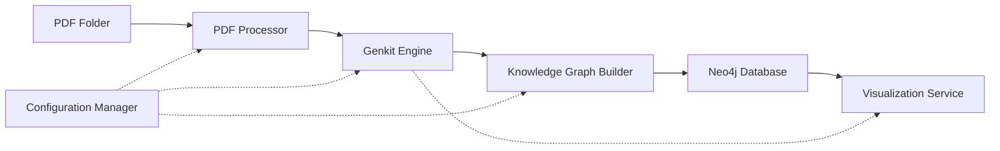

# Design Document

## Overview

Este documento describe el diseño técnico de un sistema de procesamiento de documentos PDF que construye un grafo de conocimiento en Neo4j utilizando Google Genkit como framework de IA. El sistema extrae texto de PDFs, identifica entidades y relaciones mediante análisis con IA, almacena la información en un grafo de conocimiento con capacidades de búsqueda vectorial, y proporciona visualización interactiva de los datos.

### Objetivos del Sistema

1. **Procesamiento Automatizado**: Monitorear una carpeta de PDFs y procesarlos automáticamente
2. **Extracción Inteligente**: Utilizar IA (Google Genkit) para identificar entidades y relaciones en el texto
3. **Grafo de Conocimiento**: Construir y mantener un grafo persistente en Neo4j con búsqueda vectorial
4. **Visualización Interactiva**: Proporcionar una interfaz para explorar el grafo de conocimiento
5. **Configuración Segura**: Gestionar credenciales y configuración mediante variables de entorno

### Tecnologías Principales

- **Google Genkit**: Framework de IA para análisis de texto y generación de embeddings
- **Neo4j**: Base de datos de grafos con soporte nativo para búsqueda vectorial
- **Node.js/TypeScript**: Plataforma de ejecución y lenguaje de implementación
- **pdf-parse**: Biblioteca para extracción de texto de PDFs
- **dotenv**: Gestión de variables de entorno

## Architecture

### Arquitectura de Alto Nivel

El sistema sigue una arquitectura de pipeline con cinco componentes principales:



### Flujo de Datos

1. **Ingesta**: PDF Processor monitorea la carpeta de PDFs y detecta nuevos archivos
2. **Extracción**: PDF Processor extrae texto de cada documento
3. **Análisis**: Genkit Engine procesa el texto para identificar entidades, relaciones y generar embeddings
4. **Construcción**: Knowledge Graph Builder crea nodos y relaciones en Neo4j
5. **Visualización**: Visualization Service consulta Neo4j y presenta el grafo al usuario

### Patrones Arquitectónicos

- **Pipeline Pattern**: Procesamiento secuencial de documentos a través de etapas bien definidas
- **Repository Pattern**: Knowledge Graph Builder abstrae el acceso a Neo4j
- **Configuration Pattern**: Configuration Manager centraliza la gestión de credenciales
- **Error Handling Pattern**: Cada componente maneja errores localmente y propaga información relevante

## Components and Interfaces

### 1. Configuration Manager

**Responsabilidad**: Cargar, validar y proporcionar acceso a la configuración del sistema desde variables de entorno.

**Interface**:
```typescript
interface ConfigurationManager {
  // Carga la configuración desde archivo .env
  load(): Promise<void>;
  
  // Valida que todas las credenciales requeridas están presentes
  validate(): ValidationResult;
  
  // Obtiene la configuración de Neo4j
  getNeo4jConfig(): Neo4jConfig;
  
  // Obtiene la configuración de Google API
  getGoogleConfig(): GoogleConfig;
  
  // Obtiene la ruta de la carpeta de PDFs
  getPdfFolderPath(): string;
  
  // Serializa la configuración actual a formato .env
  serialize(): string;
}

interface Neo4jConfig {
  uri: string;
  username: string;
  password: string;
}

interface GoogleConfig {
  apiKey: string;
}

interface ValidationResult {
  isValid: boolean;
  missingFields: string[];
  errors: string[];
}
```

**Implementación**:
- Utiliza `dotenv` para cargar variables de entorno
- Valida campos requeridos: `NEO4J_URI`, `NEO4J_USERNAME`, `NEO4J_PASSWORD`, `GOOGLE_API_KEY`, `PDF_FOLDER_PATH`
- Lanza excepciones si faltan credenciales críticas
- Proporciona logging detallado de errores de configuración

### 2. PDF Processor

**Responsabilidad**: Monitorear carpeta de PDFs, extraer texto de documentos, y gestionar el ciclo de vida de archivos procesados.

**Interface**:
```typescript
interface PDFProcessor {
  // Inicializa el procesador y verifica la carpeta de PDFs
  initialize(): Promise<void>;
  
  // Escanea la carpeta y retorna lista de PDFs pendientes
  scanFolder(): Promise<string[]>;
  
  // Extrae texto de un archivo PDF específico
  extractText(filePath: string): Promise<ExtractionResult>;
  
  // Mueve un archivo procesado a la subcarpeta correspondiente
  moveProcessedFile(filePath: string, status: ProcessingStatus): Promise<void>;
  
  // Procesa todos los PDFs en la carpeta
  processAll(): Promise<ProcessingReport>;
}

interface ExtractionResult {
  success: boolean;
  text?: string;
  paragraphs?: string[];
  error?: string;
  metadata: {
    fileName: string;
    pageCount: number;
    timestamp: Date;
  };
}

enum ProcessingStatus {
  SUCCESS = 'processed',
  FAILED = 'failed'
}

interface ProcessingReport {
  totalFiles: number;
  successCount: number;
  failedCount: number;
  processedFiles: string[];
  failedFiles: Array<{fileName: string, error: string}>;
}
```

**Implementación**:
- Utiliza `pdf-parse` para extracción de texto
- Crea subcarpetas `processed/` y `failed/` si no existen
- Mantiene estructura de párrafos mediante análisis de saltos de línea
- Maneja errores de PDFs protegidos, corruptos o ilegibles
- Procesa archivos secuencialmente para evitar sobrecarga de memoria
- Registra cada operación con timestamp y estado

### 3. Genkit Engine

**Responsabilidad**: Analizar texto mediante IA para identificar entidades, relaciones y generar embeddings vectoriales.

**Interface**:
```typescript
interface GenkitEngine {
  // Inicializa el motor con API keys
  initialize(config: GoogleConfig): Promise<void>;
  
  // Analiza texto y extrae entidades y relaciones
  analyzeText(text: string): Promise<AnalysisResult>;
  
  // Genera embeddings vectoriales para un texto
  generateEmbeddings(text: string): Promise<number[]>;
  
  // Genera embeddings para una consulta de búsqueda
  generateQueryEmbeddings(query: string): Promise<number[]>;
}

interface AnalysisResult {
  entities: Entity[];
  relationships: Relationship[];
  embeddings: number[];
  sourceText: string;
}

interface Entity {
  name: string;
  type: EntityType;
  sourceText: string;
  confidence: number;
}

enum EntityType {
  PERSON = 'PERSON',
  ORGANIZATION = 'ORGANIZATION',
  LOCATION = 'LOCATION',
  CONCEPT = 'CONCEPT',
  DATE = 'DATE',
  OTHER = 'OTHER'
}

interface Relationship {
  source: string;  // nombre de la entidad origen
  target: string;  // nombre de la entidad destino
  type: string;    // tipo de relación (e.g., "WORKS_AT", "LOCATED_IN")
  confidence: number;
}
```

**Implementación**:
- Utiliza Google Genkit con modelo de lenguaje (Gemini)
- Implementa prompts estructurados para extracción de entidades y relaciones
- Genera embeddings usando el modelo de embeddings de Google
- Maneja rate limiting y reintentos en caso de errores de API
- Valida y normaliza nombres de entidades (capitalización, espacios)
- Filtra entidades con baja confianza (threshold configurable)

### 4. Knowledge Graph Builder

**Responsabilidad**: Construir y mantener el grafo de conocimiento en Neo4j, incluyendo nodos, relaciones y búsqueda vectorial.

**Interface**:
```typescript
interface KnowledgeGraphBuilder {
  // Conecta a la base de datos Neo4j
  connect(config: Neo4jConfig): Promise<void>;
  
  // Crea o actualiza un nodo de entidad
  createOrUpdateEntity(entity: Entity, sourceDocument: string, embeddings: number[]): Promise<string>;
  
  // Crea una relación entre dos entidades
  createRelationship(relationship: Relationship, sourceDocument: string): Promise<void>;
  
  // Procesa un resultado de análisis completo
  processAnalysisResult(result: AnalysisResult, sourceDocument: string): Promise<GraphStats>;
  
  // Ejecuta búsqueda vectorial por similitud
  vectorSearch(queryEmbeddings: number[], limit: number): Promise<SearchResult[]>;
  
  // Obtiene el contexto (vecinos) de un nodo
  getNodeContext(nodeId: string, depth: number): Promise<GraphContext>;
  
  // Cierra la conexión a Neo4j
  disconnect(): Promise<void>;
}

interface GraphStats {
  entitiesCreated: number;
  entitiesUpdated: number;
  relationshipsCreated: number;
}

interface SearchResult {
  nodeId: string;
  entity: Entity;
  similarity: number;
  sourceDocuments: string[];
}

interface GraphContext {
  centerNode: Entity;
  neighbors: Array<{
    entity: Entity;
    relationship: string;
    direction: 'incoming' | 'outgoing';
  }>;
}
```

**Implementación**:
- Utiliza el driver oficial de Neo4j para Node.js
- Implementa índices vectoriales en Neo4j para búsqueda eficiente
- Usa transacciones para garantizar consistencia
- Implementa lógica de merge: si una entidad existe, actualiza propiedades y agrega referencia al documento
- Almacena embeddings como propiedades de tipo lista en los nodos
- Implementa reintentos con backoff exponencial para errores de conexión
- Registra estadísticas de cada operación (nodos creados/actualizados, relaciones creadas)

**Esquema de Neo4j**:
```cypher
// Nodo de Entidad
CREATE (e:Entity {
  id: string,           // UUID único
  name: string,         // nombre de la entidad
  type: string,         // tipo de entidad (PERSON, ORGANIZATION, etc.)
  sourceText: string,   // texto original donde se encontró
  embeddings: [float],  // vector de embeddings
  documents: [string],  // lista de documentos fuente
  createdAt: datetime,
  updatedAt: datetime
})

// Índice vectorial para búsqueda
CREATE VECTOR INDEX entity_embeddings FOR (e:Entity) ON (e.embeddings)
OPTIONS {indexConfig: {`vector.dimensions`: 768, `vector.similarity_function`: 'cosine'}}

// Relación entre entidades
CREATE (e1:Entity)-[r:RELATES_TO {
  type: string,         // tipo específico de relación
  sourceDocument: string,
  confidence: float,
  createdAt: datetime
}]->(e2:Entity)
```

### 5. Visualization Service

**Responsabilidad**: Consultar el grafo de conocimiento y generar visualizaciones interactivas.

**Interface**:
```typescript
interface VisualizationService {
  // Obtiene todos los nodos y relaciones (con límite opcional)
  getGraph(filters?: GraphFilters): Promise<GraphData>;
  
  // Obtiene nodos filtrados por tipo de entidad
  getNodesByType(entityType: EntityType): Promise<Entity[]>;
  
  // Obtiene nodos filtrados por documento fuente
  getNodesByDocument(documentName: string): Promise<Entity[]>;
  
  // Obtiene detalles completos de un nodo
  getNodeDetails(nodeId: string): Promise<NodeDetails>;
  
  // Genera datos de visualización en formato compatible con bibliotecas de grafos
  generateVisualizationData(graphData: GraphData): Promise<VisualizationData>;
}

interface GraphFilters {
  entityTypes?: EntityType[];
  sourceDocuments?: string[];
  maxNodes?: number;
}

interface GraphData {
  nodes: Entity[];
  edges: Array<{
    source: string;
    target: string;
    type: string;
    confidence: number;
  }>;
}

interface NodeDetails {
  entity: Entity;
  properties: Record<string, any>;
  sourceDocuments: string[];
  neighbors: GraphContext;
}

interface VisualizationData {
  nodes: Array<{
    id: string;
    label: string;
    type: string;
    color: string;
    size: number;
  }>;
  edges: Array<{
    id: string;
    source: string;
    target: string;
    label: string;
    color: string;
  }>;
}
```

**Implementación**:
- Consulta Neo4j a través de Knowledge Graph Builder
- Transforma datos del grafo a formato compatible con bibliotecas de visualización (e.g., vis.js, cytoscape.js)
- Implementa esquema de colores por tipo de entidad
- Calcula tamaño de nodos basado en número de conexiones
- Proporciona filtros interactivos por tipo y documento
- Resalta nodos encontrados en búsquedas vectoriales

## Data Models

### Modelo de Configuración

```typescript
interface SystemConfig {
  neo4j: {
    uri: string;
    username: string;
    password: string;
  };
  google: {
    apiKey: string;
  };
  pdfFolder: {
    path: string;
    processedSubfolder: string;
    failedSubfolder: string;
  };
  processing: {
    maxRetries: number;
    retryDelayMs: number;
    confidenceThreshold: number;
  };
  vectorSearch: {
    embeddingDimensions: number;
    similarityFunction: 'cosine' | 'euclidean';
    defaultLimit: number;
  };
}
```

### Modelo de Entidad

```typescript
interface Entity {
  id: string;              // UUID generado
  name: string;            // nombre normalizado de la entidad
  type: EntityType;        // tipo de entidad
  sourceText: string;      // fragmento de texto donde se encontró
  confidence: number;      // confianza del modelo (0-1)
  embeddings?: number[];   // vector de embeddings
  documents: string[];     // lista de documentos fuente
  createdAt: Date;
  updatedAt: Date;
  metadata?: Record<string, any>;  // metadatos adicionales
}
```

### Modelo de Relación

```typescript
interface Relationship {
  id: string;              // UUID generado
  source: string;          // ID de entidad origen
  target: string;          // ID de entidad destino
  type: string;            // tipo de relación (verbo normalizado)
  sourceDocument: string;  // documento donde se encontró
  confidence: number;      // confianza del modelo (0-1)
  createdAt: Date;
  metadata?: Record<string, any>;
}
```

### Modelo de Documento Procesado

```typescript
interface ProcessedDocument {
  fileName: string;
  filePath: string;
  status: ProcessingStatus;
  processedAt: Date;
  stats: {
    pageCount: number;
    textLength: number;
    entitiesExtracted: number;
    relationshipsExtracted: number;
  };
  error?: string;
}
```


## Correctness Properties

*Una propiedad es una característica o comportamiento que debe ser verdadero en todas las ejecuciones válidas de un sistema—esencialmente, una declaración formal sobre lo que el sistema debe hacer. Las propiedades sirven como puente entre las especificaciones legibles por humanos y las garantías de corrección verificables por máquinas.*

### Property 1: Identificación completa de archivos PDF

*Para cualquier* carpeta con una mezcla de archivos PDF y no-PDF, el PDF_Processor debe identificar exactamente todos y solo los archivos con extensión .pdf, y agregarlos a la cola de procesamiento.

**Validates: Requirements 1.4, 1.5**

### Property 2: Extracción de texto completa

*Para cualquier* archivo PDF válido y legible, el PDF_Processor debe extraer texto del documento y retornar un resultado exitoso con contenido no vacío.

**Validates: Requirements 2.1**

### Property 3: Preservación de estructura de párrafos

*Para cualquier* PDF con múltiples párrafos, el texto extraído debe mantener la separación entre párrafos, de modo que el número de párrafos en el resultado sea mayor que uno.

**Validates: Requirements 2.2**

### Property 4: Detección de credenciales faltantes

*Para cualquier* subconjunto de credenciales requeridas que falte en la configuración, el Configuration_Manager debe reportar específicamente cuáles credenciales están ausentes en el resultado de validación.

**Validates: Requirements 3.5**

### Property 5: Identificación de entidades en texto

*Para cualquier* texto que contenga entidades reconocibles (personas, lugares, organizaciones, conceptos), el Genkit_Engine debe retornar al menos una entidad identificada en el resultado del análisis.

**Validates: Requirements 4.2**

### Property 6: Identificación de relaciones entre entidades

*Para cualquier* texto que contenga múltiples entidades con relaciones explícitas entre ellas, el Genkit_Engine debe identificar al menos una relación en el resultado del análisis.

**Validates: Requirements 4.3**

### Property 7: Generación de embeddings con dimensiones correctas

*Para cualquier* texto válido procesado por el Genkit_Engine, los embeddings generados deben ser un vector numérico con el número de dimensiones configurado en el sistema (típicamente 768 para modelos de Google).

**Validates: Requirements 4.4**

### Property 8: Estructura completa de resultado de análisis

*Para cualquier* análisis completado por el Genkit_Engine, el resultado debe contener todos los campos requeridos: lista de entidades, lista de relaciones, vector de embeddings, y texto fuente.

**Validates: Requirements 4.5**

### Property 9: Creación de nodos con propiedades completas

*Para cualquier* entidad válida procesada por el Knowledge_Graph_Builder, debe crearse un nodo en Neo4j que contenga todas las propiedades requeridas: nombre, tipo, y texto fuente.

**Validates: Requirements 5.2**

### Property 10: Creación de relaciones dirigidas

*Para cualquier* relación válida entre dos entidades existentes, el Knowledge_Graph_Builder debe crear una arista dirigida en Neo4j desde el nodo fuente al nodo destino con el tipo de relación especificado.

**Validates: Requirements 5.3**

### Property 11: Almacenamiento de embeddings en nodos

*Para cualquier* nodo creado con embeddings asociados, el Knowledge_Graph_Builder debe almacenar el vector de embeddings como una propiedad del nodo en Neo4j.

**Validates: Requirements 5.4**

### Property 12: Asociación de nodos con documento fuente

*Para cualquier* nodo creado durante el procesamiento de un documento, el nodo debe contener una referencia al nombre del archivo PDF de origen en su lista de documentos.

**Validates: Requirements 5.5**

### Property 13: Actualización idempotente de entidades (Merge)

*Para cualquier* entidad que se procesa dos veces (del mismo o diferente documento), el Knowledge_Graph_Builder debe actualizar el nodo existente agregando el nuevo documento a la lista de fuentes, en lugar de crear un nodo duplicado. El número total de nodos para esa entidad debe permanecer en uno.

**Validates: Requirements 5.6**

### Property 14: Generación de visualización con nodos y aristas

*Para cualquier* grafo válido obtenido de Neo4j, el Visualization_Service debe generar una representación que contenga al menos un nodo por cada entidad y una arista por cada relación en el grafo original.

**Validates: Requirements 6.2**

### Property 15: Filtrado de visualización por criterios

*Para cualquier* criterio de filtrado válido (tipo de entidad o documento de origen), el Visualization_Service debe retornar únicamente los nodos que cumplan con ese criterio, y el conjunto de nodos retornados debe ser un subconjunto del grafo completo.

**Validates: Requirements 6.3, 6.4**

### Property 16: Acceso a detalles de nodo

*Para cualquier* nodo válido en el grafo, el Visualization_Service debe poder retornar sus propiedades completas y el texto fuente asociado cuando se soliciten los detalles del nodo.

**Validates: Requirements 6.5**

### Property 17: Generación de embeddings para consultas

*Para cualquier* consulta de búsqueda válida (string no vacío), el Genkit_Engine debe generar un vector de embeddings con las mismas dimensiones que los embeddings de documentos.

**Validates: Requirements 7.1**

### Property 18: Ordenamiento de resultados de búsqueda por similitud

*Para cualquier* resultado de búsqueda vectorial no vacío, los nodos retornados deben estar ordenados en orden descendente por puntuación de similitud, de modo que cada nodo tenga una puntuación mayor o igual que el siguiente.

**Validates: Requirements 7.3**

### Property 19: Inclusión de contexto en resultados de búsqueda

*Para cualquier* nodo retornado en los resultados de búsqueda vectorial, el resultado debe incluir información sobre los nodos vecinos (contexto) conectados a ese nodo en el grafo.

**Validates: Requirements 7.4**

### Property 20: Resaltado de nodos encontrados

*Para cualquier* conjunto de nodos retornados por una búsqueda, la representación de visualización debe incluir un marcador o propiedad de resaltado para cada uno de esos nodos.

**Validates: Requirements 7.5**

### Property 21: Registro de procesamiento de archivos

*Para cualquier* archivo PDF procesado (exitosamente o con error), debe existir una entrada de log que contenga el nombre del archivo, un timestamp, y el estado del procesamiento.

**Validates: Requirements 8.1**

### Property 22: Registro de estadísticas de grafo

*Para cualquier* documento procesado que resulte en la creación de entidades y relaciones, el Knowledge_Graph_Builder debe registrar el número exacto de entidades y relaciones creadas para ese documento.

**Validates: Requirements 8.2**

### Property 23: Registro de advertencias para credenciales opcionales

*Para cualquier* credencial opcional que no esté presente en la configuración, el Configuration_Manager debe registrar una advertencia específica mencionando esa credencial.

**Validates: Requirements 8.5**

### Property 24: Registro de stack trace en errores críticos

*Para cualquier* error crítico que ocurra en el sistema, el log correspondiente debe incluir el stack trace completo de la excepción.

**Validates: Requirements 8.6**

### Property 25: Procesamiento en orden de archivos

*Para cualquier* conjunto de archivos PDF en la carpeta con timestamps de creación diferentes, el PDF_Processor debe procesarlos en orden cronológico (del más antiguo al más reciente).

**Validates: Requirements 9.1**

### Property 26: Movimiento de archivos procesados exitosamente

*Para cualquier* documento PDF que se procese exitosamente sin errores, el archivo debe ser movido a la subcarpeta "processed" y no debe permanecer en la carpeta principal.

**Validates: Requirements 9.3**

### Property 27: Movimiento de archivos con errores

*Para cualquier* documento PDF cuyo procesamiento falle con un error, el archivo debe ser movido a la subcarpeta "failed" y no debe permanecer en la carpeta principal.

**Validates: Requirements 9.4**

### Property 28: Actualización de progreso de procesamiento

*Para cualquier* lote de N documentos procesados, el registro de progreso debe actualizarse después de cada documento, de modo que la suma de documentos procesados más documentos pendientes sea siempre igual a N.

**Validates: Requirements 9.5**

### Property 29: Parsing de archivo .env

*Para cualquier* archivo .env válido con pares clave-valor en formato correcto, el Configuration_Manager debe parsearlo exitosamente en un objeto de configuración que contenga todas las claves presentes en el archivo.

**Validates: Requirements 10.1**

### Property 30: Validación de campos requeridos

*Para cualquier* objeto de configuración, el método de validación debe retornar isValid=false si y solo si falta al menos un campo requerido, y la lista de campos faltantes debe contener exactamente los campos que no están presentes.

**Validates: Requirements 10.2**

### Property 31: Round-trip de serialización de configuración

*Para cualquier* objeto de configuración válido, aplicar las operaciones de serializar a formato .env y luego parsear el resultado debe producir un objeto de configuración equivalente al original (mismos valores para todas las claves).

**Validates: Requirements 10.4**

## Error Handling

### Estrategia General de Manejo de Errores

El sistema implementa una estrategia de manejo de errores en capas:

1. **Errores Recuperables**: Se registran y se reintenta la operación con backoff exponencial
2. **Errores No Recuperables**: Se registran con stack trace completo y se marca el recurso como fallido
3. **Errores Críticos**: Se registran y se detiene la ejecución del sistema

### Manejo de Errores por Componente

#### Configuration Manager

**Errores Críticos** (detienen ejecución):
- Archivo .env no existe
- Credenciales requeridas faltantes (NEO4J_URI, NEO4J_USERNAME, NEO4J_PASSWORD, GOOGLE_API_KEY, PDF_FOLDER_PATH)

**Errores No Críticos** (registran advertencia):
- Credenciales opcionales faltantes
- Valores de configuración con formato incorrecto (se usan valores por defecto)

**Implementación**:
```typescript
class ConfigurationError extends Error {
  constructor(
    message: string,
    public readonly missingFields: string[],
    public readonly isCritical: boolean
  ) {
    super(message);
  }
}
```

#### PDF Processor

**Errores Recuperables**:
- Error temporal de lectura de archivo (reintentar hasta 3 veces)

**Errores No Recuperables** (marcar archivo como fallido):
- PDF protegido con contraseña
- PDF corrupto o ilegible
- Formato de archivo inválido
- Error de permisos de lectura

**Implementación**:
```typescript
class PDFProcessingError extends Error {
  constructor(
    message: string,
    public readonly fileName: string,
    public readonly isRecoverable: boolean,
    public readonly errorType: PDFErrorType
  ) {
    super(message);
  }
}

enum PDFErrorType {
  PASSWORD_PROTECTED = 'PASSWORD_PROTECTED',
  CORRUPTED = 'CORRUPTED',
  INVALID_FORMAT = 'INVALID_FORMAT',
  PERMISSION_DENIED = 'PERMISSION_DENIED',
  READ_ERROR = 'READ_ERROR'
}
```

#### Genkit Engine

**Errores Recuperables** (reintentar con backoff exponencial):
- Rate limiting (429)
- Errores de red temporales (500, 502, 503, 504)
- Timeouts

**Errores No Recuperables**:
- API key inválida (401)
- Cuota excedida (403)
- Solicitud malformada (400)

**Implementación**:
```typescript
class GenkitAPIError extends Error {
  constructor(
    message: string,
    public readonly statusCode: number,
    public readonly isRecoverable: boolean,
    public readonly requestDetails: {
      endpoint: string;
      textLength: number;
      timestamp: Date;
    }
  ) {
    super(message);
  }
}

// Estrategia de reintentos
const retryConfig = {
  maxRetries: 3,
  initialDelayMs: 1000,
  maxDelayMs: 10000,
  backoffMultiplier: 2
};
```

#### Knowledge Graph Builder

**Errores Recuperables** (reintentar con backoff exponencial):
- Pérdida de conexión a Neo4j
- Timeouts de transacción
- Errores temporales de red

**Errores No Recuperables**:
- Credenciales de Neo4j inválidas
- Esquema de base de datos incompatible
- Violaciones de constraints
- Errores de sintaxis en queries Cypher

**Implementación**:
```typescript
class Neo4jError extends Error {
  constructor(
    message: string,
    public readonly isRecoverable: boolean,
    public readonly errorCode: string,
    public readonly query?: string
  ) {
    super(message);
  }
}

// Gestión de transacciones
async function executeWithTransaction<T>(
  operation: (tx: Transaction) => Promise<T>
): Promise<T> {
  const session = driver.session();
  const tx = session.beginTransaction();
  
  try {
    const result = await operation(tx);
    await tx.commit();
    return result;
  } catch (error) {
    await tx.rollback();
    throw error;
  } finally {
    await session.close();
  }
}
```

#### Visualization Service

**Errores Recuperables**:
- Timeouts de consulta (reintentar con límite de nodos reducido)

**Errores No Recuperables**:
- Filtros inválidos
- Nodo solicitado no existe
- Formato de datos incompatible

**Implementación**:
```typescript
class VisualizationError extends Error {
  constructor(
    message: string,
    public readonly errorType: VisualizationErrorType,
    public readonly context?: any
  ) {
    super(message);
  }
}

enum VisualizationErrorType {
  INVALID_FILTER = 'INVALID_FILTER',
  NODE_NOT_FOUND = 'NODE_NOT_FOUND',
  QUERY_TIMEOUT = 'QUERY_TIMEOUT',
  DATA_FORMAT_ERROR = 'DATA_FORMAT_ERROR'
}
```

### Logging y Monitoreo

**Niveles de Log**:
- **ERROR**: Errores que impiden completar una operación
- **WARN**: Situaciones anómalas que no impiden la ejecución
- **INFO**: Eventos importantes del sistema (inicio, fin de procesamiento, estadísticas)
- **DEBUG**: Información detallada para diagnóstico

**Formato de Log**:
```typescript
interface LogEntry {
  timestamp: Date;
  level: 'ERROR' | 'WARN' | 'INFO' | 'DEBUG';
  component: string;
  message: string;
  context?: Record<string, any>;
  stackTrace?: string;
}
```

**Implementación**:
```typescript
class Logger {
  error(component: string, message: string, error: Error, context?: any): void {
    const entry: LogEntry = {
      timestamp: new Date(),
      level: 'ERROR',
      component,
      message,
      context,
      stackTrace: error.stack
    };
    this.write(entry);
  }
  
  warn(component: string, message: string, context?: any): void {
    // Similar implementation
  }
  
  info(component: string, message: string, context?: any): void {
    // Similar implementation
  }
  
  debug(component: string, message: string, context?: any): void {
    // Similar implementation
  }
}
```

## Testing Strategy

### Enfoque Dual de Testing

El sistema utiliza un enfoque dual que combina:

1. **Unit Tests**: Para casos específicos, ejemplos concretos, y casos edge
2. **Property-Based Tests**: Para propiedades universales que deben cumplirse en todos los casos

### Property-Based Testing

**Framework**: Utilizaremos **fast-check** para TypeScript/Node.js

**Configuración**:
- Mínimo 100 iteraciones por test de propiedad
- Cada test debe referenciar la propiedad del documento de diseño mediante un comentario
- Formato de tag: `// Feature: pdf-knowledge-graph, Property {number}: {property_text}`

**Ejemplo de Implementación**:
```typescript
import fc from 'fast-check';

describe('Configuration Manager - Property-Based Tests', () => {
  // Feature: pdf-knowledge-graph, Property 31: Round-trip de serialización de configuración
  it('should preserve configuration through serialize-parse round-trip', () => {
    fc.assert(
      fc.property(
        fc.record({
          neo4j: fc.record({
            uri: fc.webUrl(),
            username: fc.string({ minLength: 1 }),
            password: fc.string({ minLength: 1 })
          }),
          google: fc.record({
            apiKey: fc.string({ minLength: 20 })
          }),
          pdfFolder: fc.record({
            path: fc.string({ minLength: 1 })
          })
        }),
        (config) => {
          const manager = new ConfigurationManager();
          const serialized = manager.serialize(config);
          const parsed = manager.parse(serialized);
          
          expect(parsed).toEqual(config);
        }
      ),
      { numRuns: 100 }
    );
  });
});
```

### Unit Testing

**Framework**: Jest para TypeScript/Node.js

**Cobertura de Unit Tests**:

1. **Configuration Manager**:
   - Carga exitosa de archivo .env con todas las credenciales
   - Error cuando falta archivo .env
   - Error cuando faltan credenciales requeridas
   - Advertencia cuando faltan credenciales opcionales

2. **PDF Processor**:
   - Creación de carpeta si no existe
   - Extracción exitosa de texto de PDF válido
   - Error con PDF protegido por contraseña
   - Error con PDF corrupto
   - Movimiento de archivos a subcarpetas correctas

3. **Genkit Engine**:
   - Inicialización exitosa con API key válida
   - Análisis de texto con entidades y relaciones
   - Generación de embeddings
   - Manejo de errores de API

4. **Knowledge Graph Builder**:
   - Conexión exitosa a Neo4j
   - Creación de nodos y relaciones
   - Merge de entidades duplicadas
   - Búsqueda vectorial
   - Manejo de errores de conexión

5. **Visualization Service**:
   - Generación de visualización
   - Filtrado por tipo y documento
   - Acceso a detalles de nodo

### Integration Testing

**Escenarios de Integración**:

1. **Pipeline Completo**:
   - Colocar PDF en carpeta → Verificar nodos en Neo4j → Verificar visualización

2. **Búsqueda Vectorial End-to-End**:
   - Procesar documentos → Ejecutar búsqueda → Verificar resultados relevantes

3. **Manejo de Errores en Pipeline**:
   - PDF corrupto → Verificar movimiento a carpeta "failed" → Verificar log de error

**Configuración de Integración**:
- Usar Neo4j en contenedor Docker para tests
- Usar mocks para API de Google en tests de integración (para evitar costos)
- Usar PDFs de prueba con contenido conocido

### Test Data

**Generadores para Property-Based Tests**:

```typescript
// Generador de configuraciones válidas
const configArbitrary = fc.record({
  neo4j: fc.record({
    uri: fc.webUrl({ validSchemes: ['bolt', 'neo4j'] }),
    username: fc.string({ minLength: 1, maxLength: 50 }),
    password: fc.string({ minLength: 8, maxLength: 100 })
  }),
  google: fc.record({
    apiKey: fc.string({ minLength: 20, maxLength: 100 })
  }),
  pdfFolder: fc.record({
    path: fc.string({ minLength: 1, maxLength: 200 })
  })
});

// Generador de entidades
const entityArbitrary = fc.record({
  name: fc.string({ minLength: 1, maxLength: 100 }),
  type: fc.constantFrom('PERSON', 'ORGANIZATION', 'LOCATION', 'CONCEPT'),
  sourceText: fc.string({ minLength: 10, maxLength: 500 }),
  confidence: fc.float({ min: 0, max: 1 })
});

// Generador de relaciones
const relationshipArbitrary = fc.record({
  source: fc.string({ minLength: 1 }),
  target: fc.string({ minLength: 1 }),
  type: fc.constantFrom('WORKS_AT', 'LOCATED_IN', 'RELATED_TO', 'MENTIONS'),
  confidence: fc.float({ min: 0, max: 1 })
});

// Generador de embeddings
const embeddingsArbitrary = fc.array(
  fc.float({ min: -1, max: 1 }),
  { minLength: 768, maxLength: 768 }
);
```

**PDFs de Prueba**:
- `simple.pdf`: Documento simple con texto plano
- `multi-paragraph.pdf`: Documento con múltiples párrafos
- `entities.pdf`: Documento con entidades conocidas (personas, lugares, organizaciones)
- `relationships.pdf`: Documento con relaciones explícitas entre entidades
- `protected.pdf`: PDF protegido con contraseña
- `corrupted.pdf`: PDF corrupto intencionalmente

### Continuous Integration

**Pipeline de CI**:
1. Lint (ESLint)
2. Type checking (TypeScript)
3. Unit tests (Jest)
4. Property-based tests (fast-check)
5. Integration tests (con Neo4j en Docker)
6. Coverage report (mínimo 80%)

**Comandos**:
```bash
npm run lint
npm run type-check
npm run test:unit
npm run test:property
npm run test:integration
npm run test:coverage
```

