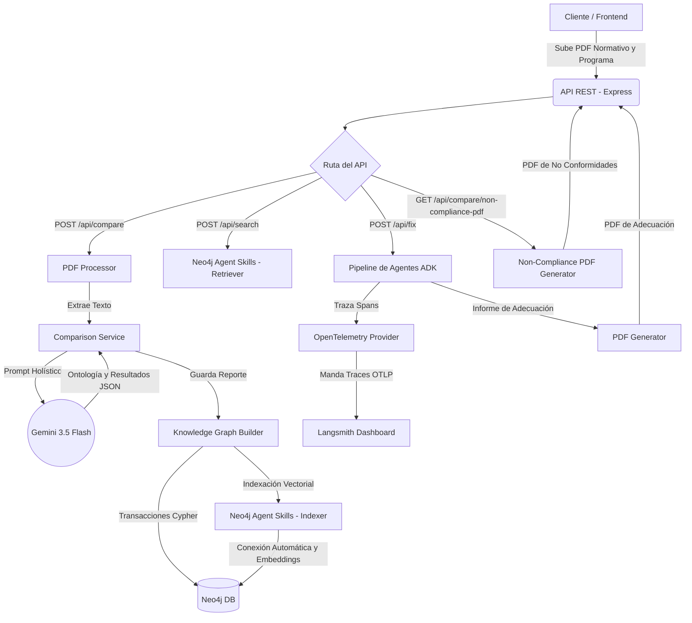
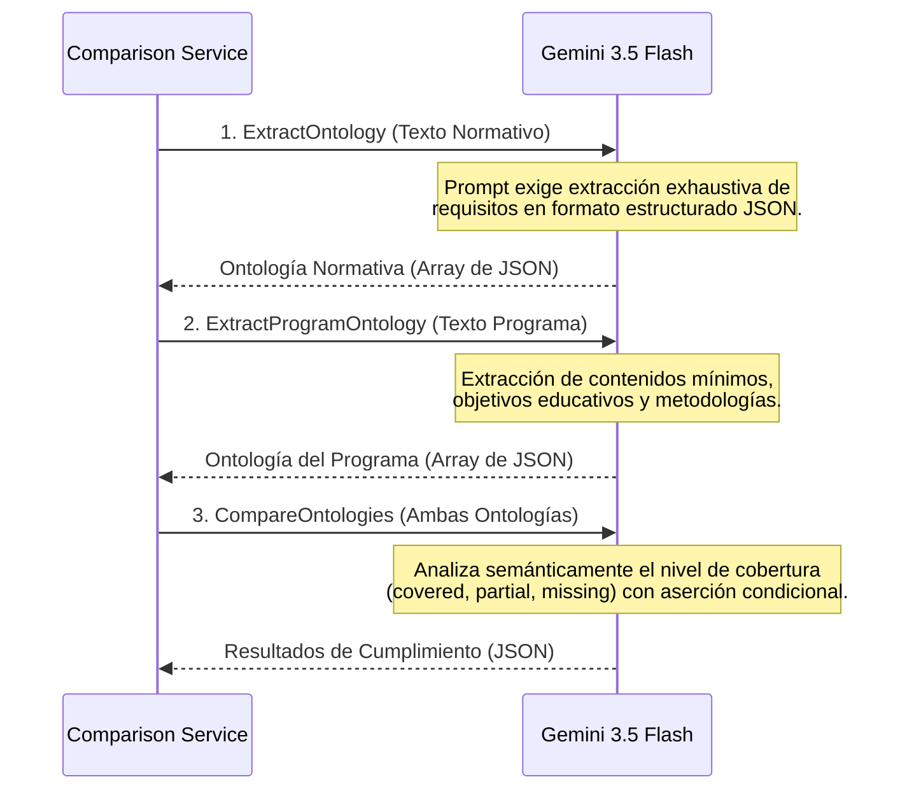
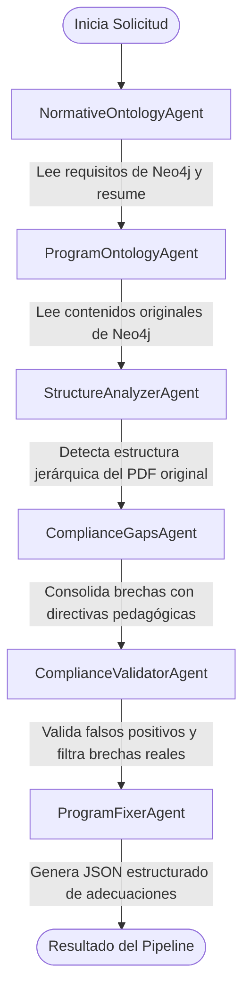
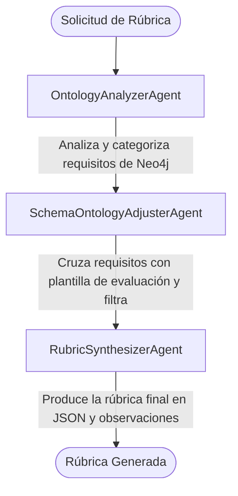
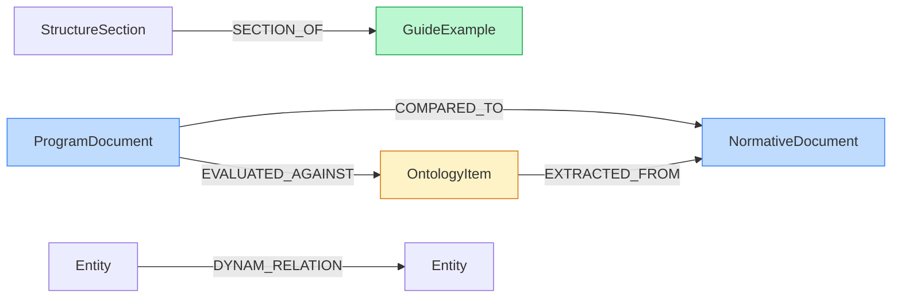
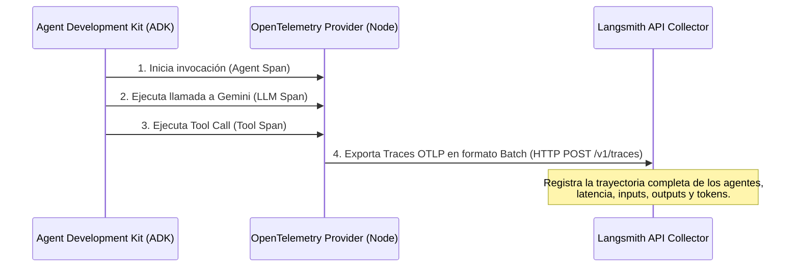
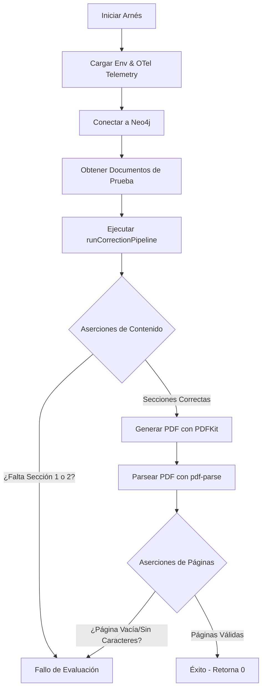
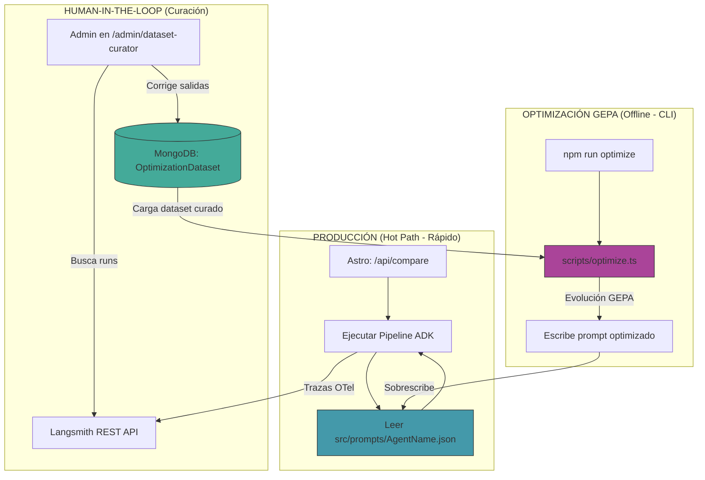

# 📚 Normative & Program Knowledge Graph (Genkit + Neo4j + ADK)

Este sistema de procesamiento holístico extrae la **Ontología Normativa** y los contenidos de **Programas Educativos** (Sílabos) a partir de documentos PDF. Mediante Inteligencia Artificial y un sistema multi-agente, construye un Grafo de Conocimiento (Knowledge Graph) estructurado en **Neo4j** para evaluar el cumplimiento normativo universitario y generar propuestas automáticas de adecuación curricular sin páginas en blanco.

La arquitectura está potenciada por **Google Genkit**, **Gemini 3.5 Flash**, **Agent Development Kit (ADK) de Google** y el ecosistema de **Agent Skills de Neo4j**.

---

## 🚀 Arquitectura y Funcionamiento

El flujo de trabajo central de la aplicación consta de tres fases principales: extracción/procesamiento, comparación en grafo/búsqueda semántica, y corrección guiada por agentes.

### 1. Diagrama de Flujo de Datos Global



### 2. Funcionamiento de la Comparación Holística (Genkit)

El modelo de lenguaje (Gemini 3.5 Flash) realiza la abstracción de ontologías en tres llamadas estructurales coordinadas por el [ComparisonService](file:///run/media/cetec/c182e059-3c92-4885-9b5a-0b2f0aeaadfe/AIProjects/grafos-test/src/services/comparison.ts):



1. **Extracción y Procesamiento**: La API recibe los PDFs normativos y del programa. Se utiliza `pdf-parse` para extraer el texto y preservar su estructura de párrafos básicos.
2. **Generación de Ontologías y Comparación (Gemini 3.5 Flash)**: El texto extraído de los documentos (hasta 700k caracteres por documento) se procesa de manera *holística* mediante **Google Gemini 3.5 Flash**. Se evitan técnicas de *chunking* para garantizar que el LLM comprenda la estructura global y emita una evaluación precisa de cumplimiento.
3. **Conexión y Persistencia (Neo4j Agent Skills)**:
   * **Conexión Genkit a través de Neo4j Agent Skills**: Para conectarnos a la base de datos de grafos y manejar las operaciones vectoriales, empleamos el plugin `genkitx-neo4j` (Neo4j Agent Skills). Este plugin se configura directamente en la instanciación de Genkit ([genkit-engine.ts](file:///run/media/cetec/c182e059-3c92-4885-9b5a-0b2f0aeaadfe/AIProjects/grafos-test/src/services/genkit-engine.ts)).
   * **Indexación y Búsqueda**: Las operaciones se manejan pasándolas por las herramientas `ai.index` (para guardar entidades generadas por el modelo en el grafo) y mediante el *retriever* para hacer búsquedas vectoriales, delegando en los *Agent Skills* toda la capa de conectividad y generación de embeddings.
   * **Native Neo4j Driver**: Mantenemos llamadas Cypher manuales (Transaccionales) exclusivamente para orquestar la topología compleja de la base de datos de grafos, enlazar entidades lógicas (ej. relaciones como `COVERS`, `REQUIRES`) y actualizar propiedades de comparación.

---

## 🤖 Sistema Multi-Agente (ADK)

El sistema implementa dos pipelines multi-agente independientes, ambos definidos mediante el **Agent Development Kit (ADK)** de Google. Los agentes se ejecutan de forma ordenada secuencialmente utilizando un `SequentialAgent` y un `InMemoryRunner` que realiza el seguimiento de estado a través de llaves de contexto compartidas.

### A. Pipeline de Corrección de Programas (Subject/Program Correction)

Este flujo se activa cuando existen brechas detectadas (requisitos faltantes o parciales) y se desea adecuar el programa del syllabus. Está definido en [multi-agent-service.ts](file:///run/media/cetec/c182e059-3c92-4885-9b5a-0b2f0aeaadfe/AIProjects/grafos-test/src/services/multi-agent-service.ts).

#### Flujo de Interacción de Agentes (Corrección)



#### Agentes Especialistas involucrados:

1. **`NormativeOntologyAgent`**:
   * **Propósito**: Consulta la ontología del documento normativo guardado en Neo4j mediante `graphBuilder.getNormativeOntology`.
   * **Salida**: Genera un análisis estructurado y resumen con los requisitos indispensables que cualquier plan de estudios debe cumplir.
2. **`ProgramOntologyAgent`**:
   * **Propósito**: Consulta Neo4j para obtener los contenidos y conceptos del syllabus original usando `graphBuilder.getProgramOntology`.
   * **Salida**: Detalla cómo está estructurado originalmente el programa educativo evaluado.
3. **`StructureAnalyzerAgent`**:
   * **Propósito**: Analiza el texto original del PDF del programa escolar para identificar su jerarquía (títulos, subtítulos, tablas y estilo de viñetas).
   * **Salida**: Un mapa estructural en JSON que permite al agente corrector ubicar dónde inyectar las modificaciones sin romper el formato nativo.
4. **`ComplianceGapsAgent`**:
   * **Propósito**: Recupera de Neo4j las brechas de cumplimiento previamente computadas y las consolida bajo dos directivas pedagógicas estrictas:
     * *Transversalidad*: No inventa materias aisladas para cubrir destrezas transversales (como ética o habilidades digitales).
     * *Gradualidad*: Recomienda insertar estas destrezas en las asignaturas y talleres integradores existentes (Proyecto Inicial, Intermedio y Trabajo Integrador Final).
5. **`ComplianceValidatorAgent`**:
   * **Propósito**: Actúa como un filtro crítico para descartar falsos positivos analizando semánticamente el texto del programa frente a las brechas reclamadas.
   * **Criterios de exclusión**:
     * *Declaraciones Negativas Válidas*: Si la norma exige regular un aspecto (ej. "indicar si se requiere software comercial") y el programa establece textualmente que "no aplica" o que "ninguna actividad requiere software comercial", el agente entiende que el aspecto está regulado y descarta la brecha.
     * *No Aplicabilidad*: Aspectos que por naturaleza de la materia no son aplicables (ej. laboratorios físicos en materias puramente abstractas).
6. **`ProgramFixerAgent`**:
   * **Propósito**: Toma el listado de brechas reales depurado y la estructura del documento original, y genera una propuesta quirúrgica de modificaciones estructuradas.
   * **Salida**: Un JSON estricto detallando: sección original, acción (`agregar | modificar | enriquecer`), justificación y el bloque de texto corregido exacto.

---

### B. Pipeline de Generación de Rúbricas (Rubric Generation Pipeline)

Este flujo se ejecuta para diseñar dinámicamente rúbricas de evaluación institucional alineadas con una directiva reglamentaria específica y una plantilla base de aspectos evaluables. Está definido en [rubric-agent-service.ts](file:///run/media/cetec/c182e059-3c92-4885-9b5a-0b2f0aeaadfe/AIProjects/grafos-test/src/services/rubric-agent-service.ts).

#### Flujo de Interacción de Agentes (Rúbricas)



#### Agentes Especialistas involucrados:

1. **`OntologyAnalyzerAgent`**:
   * **Propósito**: Examina la ontología normativa cargada en Neo4j y evalúa cada requisito bajo parámetros de verificabilidad documental e importancia.
   * **Salida**: Un JSON con categorizaciones detalladas y estadísticas de viabilidad de control (ej. requisitos verificables vs. requisitos externos).
2. **`SchemaOntologyAdjusterAgent`**:
   * **Propósito**: Cruza el análisis anterior con la plantilla de aspectos del esquema de evaluación institucional.
   * **Salida**: Clasifica los requisitos en: aspectos a incluir (con sustento normativo), aspectos normativos sin plantilla de correspondencia (se informan como observaciones adicionales) y aspectos no evaluables mediante análisis de texto (ej. infraestructura física).
3. **`RubricSynthesizerAgent`**:
   * **Propósito**: Genera los descriptores específicos para la rúbrica final de evaluación, estructurándolos rigurosamente bajo tres niveles de escala obligatorios.
   * **Salida**: Un documento JSON estructurado con títulos, dimensiones evaluadas, fundamentación normativa y niveles de calidad específicos.

---

## 🗄️ Arquitectura de Datos y Grafo de Conocimiento (Neo4j)

El almacenamiento del conocimiento se maneja en **Neo4j** (versión 5.x o superior) utilizando una estrategia híbrida. La estructura topológica completa del grafo y las relaciones semánticas se definen a continuación.

### 1. Nodos y Propiedades en el Grafo

El sistema maneja múltiples etiquetas de nodos para organizar el conocimiento normativo, las estructuras curriculares y los resultados analíticos:

| Etiqueta (Label) | Descripción | Propiedades Clave |
| :--- | :--- | :--- |
| `Entity` | Nodo general de concepto, organización o entidad semántica. | `id` (UUID), `name` (único), `type`, `sourceText`, `documents` (array), `embedding` (768d), `createdAt`, `updatedAt` |
| `Document` | Representa un archivo fuente procesado. | `name` (nombre del archivo), `text` (texto completo extraído) |
| `NormativeDocument` | Subclase de `Document`. Representa un marco regulatorio. | Hereda de `Document`. |
| `ProgramDocument` | Subclase de `Document`. Representa un programa de estudios. | Hereda de `Document`. Posee: `total`, `covered`, `partial`, `missing`, `coveragePercent` |
| `OntologyItem` | Subclase de `Entity`. Elemento normativo de acreditación. | `id` (ej: REQ-001), `requirement`, `category`, `description`, `keywords`, `sourceText` |
| `Rubric` | Almacena una rúbrica sintética generada por el sistema. | `title`, `subtitle`, `normativeDocument`, `rubricJson` (JSON serializado), `pdfBase64`, `generatedAt` |
| `GuideExample` | Plantilla estructural o guía docente de referencia. | `name`, `text`, `sectionCount`, `createdAt` |
| `StructureSection` | Secciones jerárquicas que estructuran el `GuideExample`. | `title`, `content`, `order`, `createdAt` |
| `EvaluableAspect` | Elemento particular definido en la plantilla base a auditar. | `schemaName`, `aspectId`, `aspect`, `description`, `category` |

### 2. Relaciones del Grafo (Conectividad)

El sistema enlaza de forma determinista la ontología de los documentos y los resultados de cumplimiento mediante las siguientes relaciones:



*   `(:ProgramDocument)-[:COMPARED_TO]->(:NormativeDocument)`: Enlaza un programa con su marco normativo de evaluación.
*   `(:OntologyItem)-[:EXTRACTED_FROM]->(:NormativeDocument)`: Traza el origen de cada requisito normativo hacia su documento regulatorio padre.
*   `(:ProgramDocument)-[:EVALUATED_AGAINST {status, confidence, evidence, suggestion, updatedAt}]->(:OntologyItem)`: Modela la evaluación granular de cumplimiento. La relación contiene las propiedades de auditoría (estado, evidencias y recomendaciones).
*   `(:StructureSection)-[:SECTION_OF]->(:GuideExample)`: Modela la pertenencia jerárquica de secciones a una guía/plantilla de referencia.
*   `(:Entity)-[:SEMANTIC_RELATION]->(:Entity)`: Vincula conceptos extraídos de forma genérica (ej. `REQUIRES`, `COVERS`, etc. normalizados a mayúsculas).

### 3. Conectividad Híbrida: Driver Nativo vs. Agent Skills

Para optimizar el rendimiento y la flexibilidad, el sistema implementa dos canales de comunicación con Neo4j en [knowledge-graph-builder.ts](file:///run/media/cetec/c182e059-3c92-4885-9b5a-0b2f0aeaadfe/AIProjects/grafos-test/src/services/knowledge-graph-builder.ts):

*   **Neo4j Native Driver (`neo4j-driver`)**: Maneja transacciones atómicas complejas escritas en lenguaje **Cypher**. Se utiliza para crear restricciones de unicidad, crear las relaciones complejas (`EVALUATED_AGAINST`, `COMPARED_TO`) y realizar lecturas masivas de ontologías.
*   **Neo4j Agent Skills (`genkitx-neo4j`)**: Encapsula las tareas de indexación vectorial (`ai.index` con `entityIndexer`) y de recuperación semántica (`ai.retrieve` con `entityRetriever`), vinculando de forma automática los embeddings vectoriales a los nodos `:Entity` en base al índice `entity_embeddings`.

---

## 🔤 Sistema de Embeddings y Búsqueda Vectorial

Para habilitar la búsqueda semántica e identificar relaciones implícitas de correspondencia en el grafo de conocimiento, el sistema cuenta con un flujo de procesamiento vectorial:

1.  **Modelo de Embeddings**: Se utiliza el modelo **`sentence-transformers/all-mpnet-base-v2`** a través de la API de inferencia de HuggingFace.
2.  **Dimensiones y Distancia**: Genera vectores de **768 dimensiones**. La base de datos de Neo4j los almacena y evalúa mediante la métrica de **similitud de coseno** (`vector.similarity_function: 'cosine'`).
3.  **Configuración del Índice**: El arnés crea un índice vectorial en Neo4j al conectarse:
    ```cypher
    CREATE VECTOR INDEX entity_embeddings IF NOT EXISTS
    FOR (e:Entity) ON (e.embedding)
    OPTIONS {indexConfig: {
      `vector.dimensions`: 768,
      `vector.similarity_function`: 'cosine'
    }}
    ```
4.  **Indexación e Inferencia**:
    *   Al guardar entidades (`createOrUpdateEntity`), se computa el vector vía HuggingFace utilizando un token de entorno `HF_TOKEN`.
    *   Este vector se asocia al nodo mediante la llamada al indexador de Genkit (`ai.index()`), asignando el fragmento de texto al atributo `sourceText` y guardando el vector en `embedding`.
5.  **Búsqueda Semántica**: Se ejecuta de forma nativa a través del retriever de Genkit (`ai.retrieve`), el cual toma consultas de lenguaje natural, genera sus embeddings sobre la marcha y consulta el índice vectorial de Neo4j para retornar los nodos más afines con su respectivo puntaje de similitud (`score`).

---

## 📝 Gestión de Rúbricas de Evaluación

La generación y el control de cumplimiento de las rúbricas es un proceso fundamental del sistema para medir la calidad del syllabus frente a las exigencias normativas.

### 1. Mapeo y Ajuste de Requisitos
Al cruzar la ontología del marco regulador con una plantilla base de evaluación (a través del `SchemaOntologyAdjusterAgent`), el sistema identifica y descarta la ambigüedad curricular. Los aspectos que no constan de sustento normativo directo o los requisitos normativos que exigen verificaciones externas (como existencia de infraestructura física o laboratorios presenciales) se excluyen de la rúbrica formal de calidad del documento, derivándolos a una sección especial de **observaciones externas**.

### 2. Niveles de Cumplimiento Estandarizados
La rúbrica resultante se compone de criterios de evaluación de 3 niveles fijos de rendimiento:

*   **Cumple Totalmente (2 puntos)**: Nivel óptimo. El documento contiene evidencia clara, explícita y completa del cumplimiento del requisito.
*   **Cumple Parcialmente (1 punto)**: Nivel aceptable con observaciones. El aspecto se aborda pero con deficiencias, falta de detalle o de forma implícita.
*   **No Cumple (0 puntos)**: Nivel deficiente o crítico. Ausencia absoluta del concepto o el requisito en el documento evaluado.

### 3. Persistencia de la Rúbrica en Neo4j
Una vez que el pipeline multi-agente genera la rúbrica y se compila su versión en PDF para el usuario, el resultado se almacena en Neo4j en un nodo específico de tipo `:Rubric`. Este nodo encapsula el árbol JSON completo del diseño evaluativo (`rubricJson`) y un string en formato **base64** conteniendo el binario del PDF (`pdfBase64`), permitiendo su descarga instantánea y visualización en el frontend sin requerir almacenamiento en disco local o buckets de S3.

---

## 🛠️ Motor de Corrección y Adecuación Curricular

Cuando el sistema evalúa un programa escolar y detecta deficiencias, permite aplicar adecuaciones inteligentes orientadas a cubrir las brechas sin alterar negativamente la identidad original de la materia.

### 1. Directivas Pedagógicas Transversales
Para evitar la sobrecarga del plan de estudios, los agentes aplican dos criterios fundamentales:
*   **Transversalidad**: No propone la creación de nuevas asignaturas para requisitos transversales (por ejemplo, competencias de comunicación, ética profesional o tecnologías digitales). En su lugar, diseña adiciones de contenidos curriculares que enriquecen los trayectos ya existentes.
*   **Gradualidad**: Utiliza los espacios de integración curricular (proyectos iniciales, intermedios e integradores finales - TIF) para incorporar la práctica de estas competencias de forma contextualizada.

### 2. Filtrado de Falsos Positivos (Validación Semántica)
El `ComplianceValidatorAgent` evalúa semánticamente si las deficiencias arrojadas son reales. Esto previene correcciones innecesarias analizando **Declaraciones Negativas Válidas**:
> [!IMPORTANT]
> Si una norma exige detallar la regulación de un aspecto (ej. "indicar requerimiento de laboratorios especiales") y en el programa del docente se detalla explícitamente una negación (ej. "Esta materia no requiere de laboratorios especiales"), el validador interpreta esto como una regulación completa del tema en la guía docente y descarta la brecha de cumplimiento.

### 3. Generación Quirúrgica de Adecuaciones
El `ProgramFixerAgent` no vuelve a redactar todo el programa del syllabus. En su lugar, emite un objeto estructurado JSON indicando la sección exacta donde impactar la mejora (ej: "Metodología de Enseñanza"), la acción a tomar (`agregar`, `modificar`, `enriquecer`), la justificación pedagógica y el texto exacto a incorporar. Esto optimiza el consumo de tokens y reduce drásticamente el tiempo de respuesta.

### 4. Generación de PDF sin Páginas Vacías
El generador de PDFs de no conformidad y de adecuaciones ([pdf-generator.ts](file:///run/media/cetec/c182e059-3c92-4885-9b5a-0b2f0aeaadfe/AIProjects/grafos-test/src/services/pdf-generator.ts)) implementa una solución de maquetado en **PDFKit**. 
Para evitar páginas en blanco debidas al auto-paginado cuando se calculan cabeceras y pies de página en las coordenadas límite, se ajusta temporalmente el margen inferior de página a 0:
```typescript
const originalBottomMargin = doc.page.margins.bottom;
doc.page.margins.bottom = 0; // Deshabilita temporalmente el margen inferior
// Dibujo de pie de página
doc.page.margins.bottom = originalBottomMargin; // Restaura margen original
```
El arnés de pruebas valida página por página que la cantidad de caracteres extraídos del PDF sea mayor a 0, garantizando la calidad formal del reporte descargable.

---

## 📡 Telemetría e Integración con Langsmith

El sistema de agentes de ADK está instrumentado utilizando el estándar de **OpenTelemetry (OTel)**. Toda la ejecución de los agentes, las herramientas llamadas y las consultas internas a modelos de Gemini son capturadas e integradas con **Langsmith** para su trazabilidad y evaluación en producción.

### Flujo de Datos de Telemetría



### Configuración en el `.env`
Para habilitar el registro de las trayectorias de agentes en Langsmith, se configuran las variables en [.env](file:///run/media/cetec/c182e059-3c92-4885-9b5a-0b2f0aeaadfe/AIProjects/grafos-test/.env):
```ini
# Langsmith Project credentials
LANGSMITH_API_KEY=tu_api_key_de_langsmith
LANGSMITH_ENDPOINT=https://api.smith.langchain.com
LANGSMITH_PROJECT=grafo

# Configuración estándar de OpenTelemetry para exportar trazas a Langsmith
OTEL_EXPORTER_OTLP_TRACES_ENDPOINT=https://api.smith.langchain.com/v1/traces
# Nota: Reemplazar espacios y comas en los encabezados OTLP según sea necesario
OTEL_EXPORTER_OTLP_HEADERS=x-api-key=tu_api_key_de_langsmith
```

El servidor web Express ([server.ts](file:///run/media/cetec/c182e059-3c92-4885-9b5a-0b2f0aeaadfe/AIProjects/grafos-test/src/server.ts)) carga automáticamente esta configuración al arrancar y ejecuta `maybeSetOtelProviders()` de ADK para dar de alta el pipeline de OpenTelemetry.

---

## 🧪 Arnés de Evaluación (Evaluation Harness)

Para validar de forma automatizada y sin intervención manual el correcto funcionamiento del pipeline de agentes y el formato del PDF resultante, se diseñó e implementó un Arnés de Evaluación en [run-eval.ts](file:///run/media/cetec/c182e059-3c92-4885-9b5a-0b2f0aeaadfe/AIProjects/grafos-test/tests/harness/run-eval.ts).

### Flujo de Validación del Arnés



### Aserciones Ejecutadas:
1.  **Aserciones de Contenido**: Verifica mediante análisis de texto que la respuesta final del agente contenga explícitamente las secciones estructuradas requeridas:
    *   `1. RESUMEN DE REQUISITOS FALTANTES`
    *   `2. PROPUESTA DE CORRECCIÓN PARA REQUISITOS PARCIALES`
2.  **Prevención de Páginas en Blanco (Bug de Auto-Pagination)**: El Arnés de Evaluación analiza página por página el texto extraído del PDF final. Si la longitud de caracteres en el cuerpo de cualquier página es 0, el arnés falla inmediatamente con error `exit 1`.

---
---

## 📈 Optimización de Prompts (DSPy & GEPA)

El sistema incorpora un arnés de **Optimización de Prompts offline** basado en los conceptos de **DSPy** (Signatures y Plantillas desacopladas) y ejecuta el motor evolutivo **GEPA** (Gradient-free Evolution of Prompts and Agents) mediante la biblioteca `gepa-ts`.

### 1. Concepto y Flujo de Trabajo

El flujo de optimización está completamente desacoplado del "Hot Path" de producción para evitar latencias de red y consumo excesivo de tokens durante las consultas habituales de los usuarios:



1. **Signatures Locales**: Los prompts activos de los agentes se guardan en archivos JSON físicos (`src/prompts/<AgentName>.json`) declarando sus firmas de entrada/salida y su plantilla de instrucción.
2. **Curación (Human-in-the-Loop)**: El panel administrador `/admin/dataset-curator` permite consultar ejecuciones reales registradas en Langsmith, corregir a mano las respuestas del LLM que fueron deficientes, y guardarlas en la colección MongoDB `OptimizationDataset` como "Gold Standard".
3. **Evolución GEPA**: De forma offline, el script de optimización carga los casos curados de MongoDB, genera mutaciones del prompt y evalúa cuáles candidatos obtienen la mejor calificación promedio. Al finalizar, actualiza automáticamente el JSON local.

---

### 2. El Rol de los dos LLM en la Optimización

GEPA trabaja con dos categorías asimétricas de modelos para equilibrar precisión y costo:

#### A. Task & Judge LLM (Modelo de Tarea y Juez)
*   **Rol**:
    *   **Modelo de Tarea**: Ejecuta el prompt candidato sobre las entradas del ejemplo para producir la salida del agente.
    *   **Modelo de Juez**: Actúa como un evaluador semántico (*LLM-as-a-judge*). Compara la respuesta generada por el candidato frente al Gold Standard (respuesta esperada de la base de datos) y emite una puntuación decimal de `0.0` a `1.0` con una breve justificación en español.
*   **Modelos Recomendados**: Modelos muy rápidos y económicos como `gemini-2.5-flash` o `groq` (`llama-3.3-70b-versatile`).

#### B. Reflection LLM (Modelo de Reflexión)
*   **Rol**: Analiza el prompt actual, el historial de ejecuciones evaluadas (entradas, salidas generadas, Gold Standard, scores y el feedback del Juez) y propone una instrucción nueva y corregida que solucione de forma inteligente los errores detectados en la iteración anterior.
*   **Modelos Recomendados**: Modelos con alta capacidad de razonamiento. Por defecto utiliza `gemini-2.5-flash` para evitar límites de cuota (Rate Limits), pero permite alternar a `gemini-2.5-pro` para proponer ideas de mutación significativamente más sofisticadas.

---

### 3. Comandos de Consola y Ejecución

El sistema proporciona dos scripts en la raíz del proyecto para evaluar y optimizar:

#### A. Medir Calidad Actual (Evaluación)
Mide el score del prompt que está guardado actualmente en tu disco local contra las muestras curadas en MongoDB.
```bash
# Formato: npm run evaluate -- --agent <NombreAgente> [--provider <provider>] [--judge <provider>]
npm run evaluate -- --agent ComplianceValidatorAgent
```
*Si la base de datos no tiene curaciones previas para ese agente, el script sembrará ejemplos de prueba realistas de forma automática.*

#### B. Ejecutar el Optimizador GEPA
Corre el bucle evolutivo para refinar la plantilla de instrucción y sobrescribir el archivo local.
```bash
# Formato: npm run optimize -- --agent <NombreAgente> [--provider <provider>] [--max-calls <n>] [--reflection-model <model>]
npm run optimize -- --agent ComplianceValidatorAgent --max-calls 6 --reflection-model gemini-2.5-flash
```

---

### 4. Cómo Comparar y Validar los Resultados

Para contrastar el impacto de la optimización en los prompts de tus agentes:
1.  **Score Promedio en Consola**: Al finalizar la optimización, la consola imprime el **Score Inicial Estimado** del prompt baseline frente al **Score del Mejor Candidato** tras aplicar las mutaciones.
2.  **Git Diff**: Al guardarse físicamente en los archivos JSON del repositorio, puedes correr:
    ```bash
    git diff src/prompts/ComplianceValidatorAgent.json
    ```
    Esto te mostrará exactamente qué directivas, aclaraciones o limitaciones agregó el modelo de reflexión para optimizar la salida y corregir los casos fallantes detectados.

---

## 🛠 Instalación y Scripts de Ejecución

### 1. Requisitos
*   **Node.js 18+** (Recomendado versión 20 LTS o superior).
*   Una instancia de **Neo4j 5.x** corriendo localmente o en AuraDB.
*   API Key de **Google Generative AI** (AI Studio) y de **Langsmith**.

### 2. Comandos Disponibles

*   **Levantar el entorno de desarrollo local**:
    ```bash
    npm run dev
    ```
*   **Correr pruebas unitarias (Jest)**:
    ```bash
    npm run test
    ```
*   **Verificar tipos y compilación de TypeScript**:
    ```bash
    npm run lint
    ```
*   **Ejecutar el Arnés de Evaluación (Verificación Completa)**:
    ```bash
    npm run test:harness
    ```

### 3. Verificación Completa a Demanda (ini.sh)
Hemos empaquetado todo el proceso de salud de la aplicación en el script ejecutable [ini.sh](file:///run/media/cetec/c182e059-3c92-4885-9b5a-0b2f0aeaadfe/AIProjects/grafos-test/ini.sh). Al ejecutar `./ini.sh`, el sistema realiza automáticamente los siguientes pasos en orden:
1.  Verificación e instalación de dependencias del proyecto (`npm install`).
2.  Chequeo estático de tipos de TypeScript (`npm run lint`).
3.  Ejecución de la suite de pruebas unitarias (`npm run test`).
4.  Lanzamiento del Arnés de Evaluación completo (`npm run test:harness`) con carga automática de OTel para su visualización en Langsmith.

Para ejecutar la verificación on-demand:
```bash
./ini.sh
```

---

## ☁️ Despliegue en Vercel

El proyecto está preparado para desplegarse como **Serverless Functions** en Vercel.

1.  **Configuración de `vercel.json`**: Enruta las llamadas a `/api/*` hacia la función serverless definida en `api/index.ts`.
2.  **Manejo de FileSystem**: Adaptado para no fallar en entornos Read-Only al realizar el procesamiento de PDFs y guardado de archivos temporales en memoria (usando buffers `multer`).
