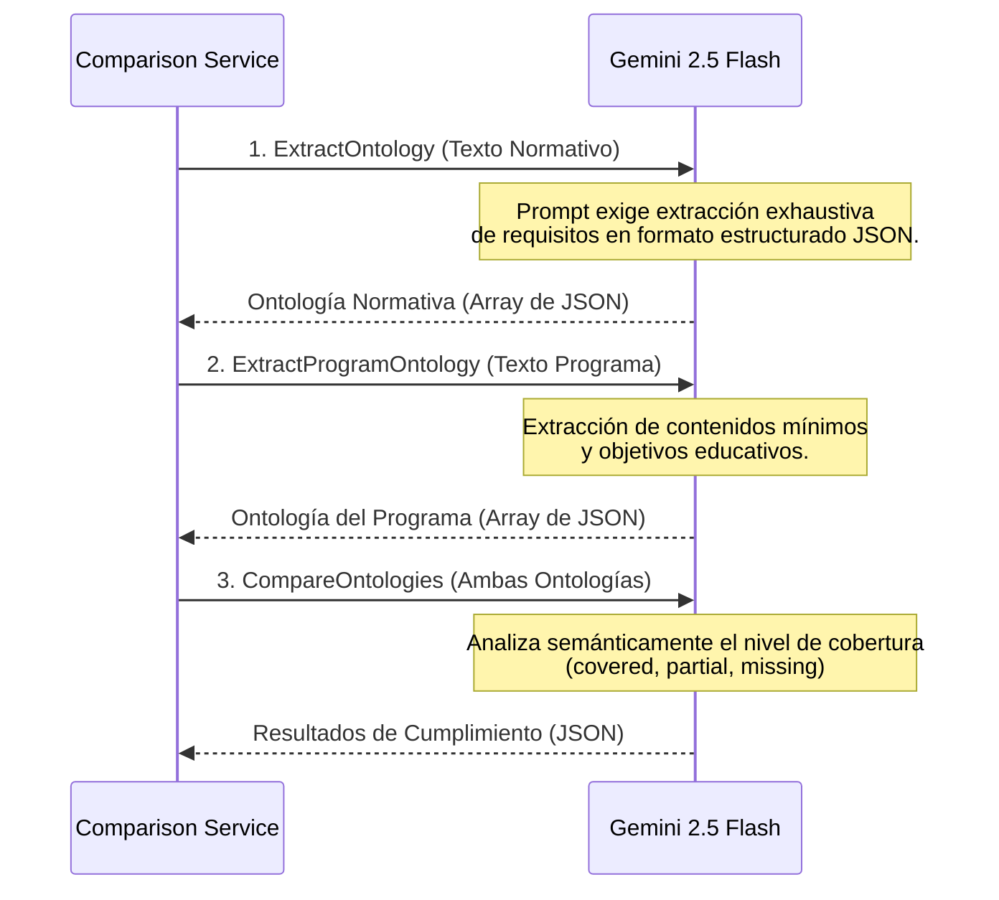
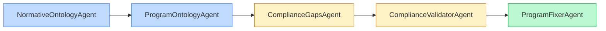
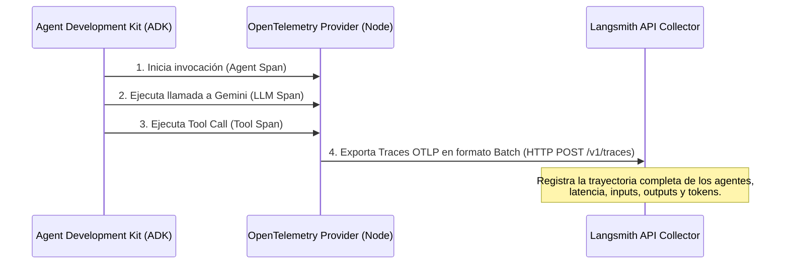
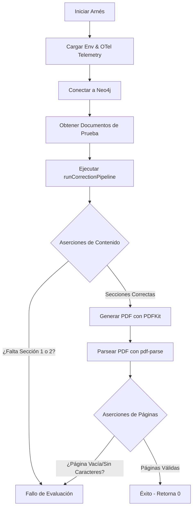

# 📚 Normative & Program Knowledge Graph (Genkit + Neo4j + ADK)

Este sistema de procesamiento holístico extrae la **Ontología Normativa** y los contenidos de **Programas Educativos** (Sílabos) a partir de documentos PDF, y mediante Inteligencia Artificial y un sistema multi-agente, construye un Grafo de Conocimiento (Knowledge Graph) estructurado en **Neo4j** para evaluar el cumplimiento normativo universitario y generar propuestas automáticas de adecuación curricular sin páginas en blanco.

La arquitectura está potenciada por **Google Genkit**, **Gemini 2.5 Flash**, **Agent Development Kit (ADK) de Google** y el ecosistema de **Agent Skills de Neo4j**.

---

## 🚀 Arquitectura y Funcionamiento

El flujo de trabajo central de la aplicación consta de tres fases principales: extracción/procesamiento, comparación en grafo/búsqueda semántica, y corrección guiada por agentes.

### 1. Diagrama de Flujo de Datos Global


### 2. Funcionamiento de la Comparación Holística (Genkit)

El modelo de lenguaje (Gemini 2.5 Flash) realiza la abstracción de ontologías en tres llamadas estructurales coordinadas por el `ComparisonService`:



1.  **Extracción y Procesamiento**: La API recibe los PDFs normativos y del programa a través de endpoints REST en **Express.js** (`multer`). Se utiliza `pdf-parse` para extraer el texto y preservar su estructura de párrafos básicos.
2.  **Generación de Ontologías y Comparación (Gemini 2.5 Flash)**: El texto extraído de los documentos (hasta 700k caracteres por documento) se procesa de manera *holística* mediante **Google Gemini 2.5 Flash**. Se evitan técnicas de *chunking* para garantizar que el LLM comprenda la estructura global y emita una evaluación precisa de cumplimiento.
3.  **Conexión y Persistencia (Neo4j Agent Skills)**:
    *   **Conexión Genkit a través de Neo4j Agent Skills**: Para conectarnos a la base de datos de grafos y manejar las operaciones vectoriales, empleamos el plugin `genkitx-neo4j` (Neo4j Agent Skills). Este plugin se configura directamente en la instanciación de Genkit, pasándole o inyectando las credenciales (URI, Username, Password). Esto permite que todo el framework de agentes se conecte a Neo4j de forma transparente y automática.
    *   **Indexación y Búsqueda**: Las operaciones se manejan pasándolas por las herramientas `ai.index` (para guardar entidades generadas por el modelo en el grafo) y mediante el *retriever* para hacer búsquedas vectoriales, delegando en los *Agent Skills* toda la capa de conectividad y generación de embeddings.
    *   **Native Neo4j Driver**: Mantenemos llamadas Cypher manuales (Transaccionales) exclusivamente para orquestar la topología compleja de la base de datos de grafos, enlazar entidades lógicas (ej. relaciones como `COVERS`, `REQUIRES`) y actualizar propiedades de comparación.

---

## 🤖 Sistema Multi-Agente (ADK)

Cuando un programa de materia cuenta con brechas (requisitos faltantes o parciales), el usuario puede activar la corrección inteligente desde el frontend. Esta acción dispara el **Pipeline de Agentes** definido en [multi-agent-service.ts](file:///media/dracero/08c67654-6ed7-4725-b74e-50f29ea60cb21/pythonAI-Others/grafo-test/src/services/multi-agent-service.ts).

### Arquitectura de Agentes Secuenciales

El pipeline está orquestado mediante un `SequentialAgent` que ejecuta de forma ordenada cinco agentes especialistas de ADK:



1.  **`NormativeOntologyAgent`**: Consulta la base de datos de grafos de Neo4j para recuperar la ontología normativa analizada. Resume y estructura los requisitos que cualquier plan de estudios debe cumplir.
2.  **`ProgramOntologyAgent`**: Consulta Neo4j para obtener los contenidos y la organización del programa actual de la materia (objetivos originales, temas).
3.  **`ComplianceGapsAgent`**: Lee las brechas normativas identificadas entre ambos documentos. Consolida y estructura las deficiencias y redacta sugerencias basadas en directivas pedagógicas específicas:
    *   *Transversalidad*: No propone nuevas materias para competencias transversales (como herramientas digitales o ética).
    *   *Gradualidad*: Recomienda insertar y enriquecer los espacios de integración curricular existentes (proyectos introductorios de primer año, sustentabilidad y trabajos integradores finales).
4.  **`ComplianceValidatorAgent` (Agente Validador Semántico)**: Valida de manera holística si las brechas consolidadas son reales o representan falsos positivos. Descarta brechas si el programa incluye declaraciones legítimas de no aplicabilidad o negativas justificados (e.g. "no se concede dispensa", "no hay softwares requeridos").
5.  **`ProgramFixerAgent`**: Es el agente de cierre. Toma el análisis del pipeline depurado por el validador y produce un **Informe de Adecuación Ejecutivo** compuesto por dos secciones:
    *   **Resumen de Requisitos Faltantes** (con viñetas de lo ausente).
    *   **Propuesta de Corrección para Requisitos Parciales** (cómo enriquecer transversalmente el plan de estudios).
    *   *Optimización*: No reescribe todo el programa de estudios original. Esto previene el desbordamiento de tokens y acelera drásticamente el flujo de procesamiento.

---

## 📡 Telemetría e Integración con Langsmith

El sistema de agentes de ADK está instrumentado utilizando el estándar de **OpenTelemetry (OTel)**. Toda la ejecución de los agentes, las herramientas llamadas y las consultas internas a modelos de Gemini son capturadas e integradas con **Langsmith** para su trazabilidad y evaluación en producción.

### Flujo de Datos de Telemetría



### Configuración en el `.env`
Para habilitar el registro de las trayectorias de agentes en Langsmith, se configuran las variables en [.env](file:///media/dracero/08c67654-6ed7-4725-b74e-50f29ea60cb21/pythonAI-Others/grafo-test/.env):
```ini
# Langsmith Project credentials
LANGSMITH_API_KEY=tu_api_key_de_langsmith
LANGSMITH_ENDPOINT=https://api.smith.langchain.com
LANGSMITH_PROJECT=grafo

# Configuración estándar de OpenTelemetry para exportar trazas a Langsmith
OTEL_EXPORTER_OTLP_TRACES_ENDPOINT=https://api.smith.langchain.com/v1/traces
OTEL_EXPORTER_OTLP_HEADERS=x-api-key=tu_api_key_de_langsmith
```

El servidor web Express ([server.ts](file:///media/dracero/08c67654-6ed7-4725-b74e-50f29ea60cb21/pythonAI-Others/grafo-test/src/server.ts)) carga automáticamente esta configuración al arrancar y ejecuta `maybeSetOtelProviders()` de ADK para dar de alta el pipeline de OpenTelemetry.

---

## 🧪 Arnés de Evaluación (Evaluation Harness)

Para validar de forma automatizada y sin intervención manual el correcto funcionamiento del pipeline de agentes y el formato del PDF resultante, se diseñó e implementó un Arnés de Evaluación en [run-eval.ts](file:///media/dracero/08c67654-6ed7-4725-b74e-50f29ea60cb21/pythonAI-Others/grafo-test/tests/harness/run-eval.ts).

### Flujo de Validación del Arnés



### Aserciones Ejecutadas:
1.  **Aserciones de Contenido**: Verifica mediante análisis de texto que la respuesta final del agente contenga explícitamente las secciones estructuradas requeridas:
    *   `1. RESUMEN DE REQUISITOS FALTANTES`
    *   `2. PROPUESTA DE CORRECCIÓN PARA REQUISITOS PARCIALES`
2.  **Prevención de Páginas en Blanco (Bug de Auto-Pagination)**: 
    *   En [pdf-generator.ts](file:///media/dracero/08c67654-6ed7-4725-b74e-50f29ea60cb21/pythonAI-Others/grafo-test/src/services/pdf-generator.ts) se corrigió un bug clásico de PDFKit en el cual posicionar el pie de página (`pageHeight - 36`) por debajo del margen inferior (`54pt`) disparaba el auto-salto de página y añadía hojas vacías al final. El generador ahora establece temporalmente `doc.page.margins.bottom = 0` al dibujar las cabeceras/pies de página y lo restaura inmediatamente.
    *   El Arnés de Evaluación analiza página por página el texto extraído del PDF final. Si la longitud de caracteres en el cuerpo de cualquier página es 0, el arnés falla inmediatamente con error `exit 1`.

---

## 🛠 Instalación y Scripts de Ejecución

### 1. Requisitos
*   **Node.js 18+** (Recomendado versión 20 LTS o superior).
*   Una instancia de **Neo4j 5.x** corriendo localmente o en AuraDB.
*   API Key de **Google Generative AI** (AI Studio) y de **Langsmith**.

### 2. Comandos Disponibles

*   **Levantar el entorno de desarrollo local**:
    ```bash
    npm run dev
    ```
*   **Correr pruebas unitarias (Jest)**:
    ```bash
    npm run test
    ```
*   **Verificar tipos y compilación de TypeScript**:
    ```bash
    npm run lint
    ```
*   **Ejecutar el Arnés de Evaluación (Verificación Completa)**:
    ```bash
    npm run test:harness
    ```

### 3. Verificación Completa a Demanda (ini.sh)
Hemos empaquetado todo el proceso de salud de la aplicación en el script ejecutable [ini.sh](file:///media/dracero/08c67654-6ed7-4725-b74e-50f29ea60cb21/pythonAI-Others/grafo-test/ini.sh). Al ejecutar `./ini.sh`, el sistema realiza automáticamente los siguientes pasos en orden:
1.  Verificación e instalación de dependencias del proyecto (`npm install`).
2.  Chequeo estático de tipos de TypeScript (`npm run lint`).
3.  Ejecución de la suite de pruebas unitarias (`npm run test`).
4.  Lanzamiento del Arnés de Evaluación completo (`npm run test:harness`) con carga automática de OTel para su visualización en Langsmith.

Para ejecutar la verificación on-demand:
```bash
./ini.sh
```

---

## ☁️ Despliegue en Vercel

El proyecto está preparado para desplegarse como **Serverless Functions** en Vercel.

1.  **Configuración de `vercel.json`**: Enruta las llamadas a `/api/*` hacia la función serverless definida en `api/index.ts`.
2.  **Manejo de FileSystem**: Adaptado para no fallar en entornos Read-Only al realizar el procesamiento de PDFs y guardado de archivos temporales en memoria (usando buffers `multer`).
