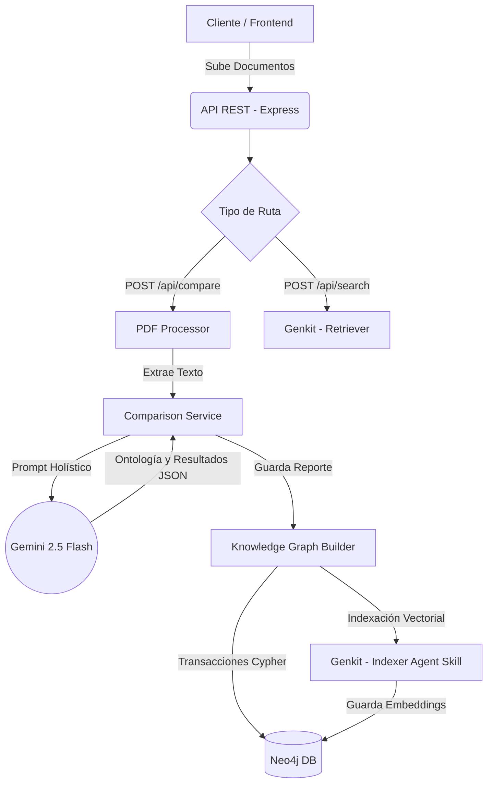
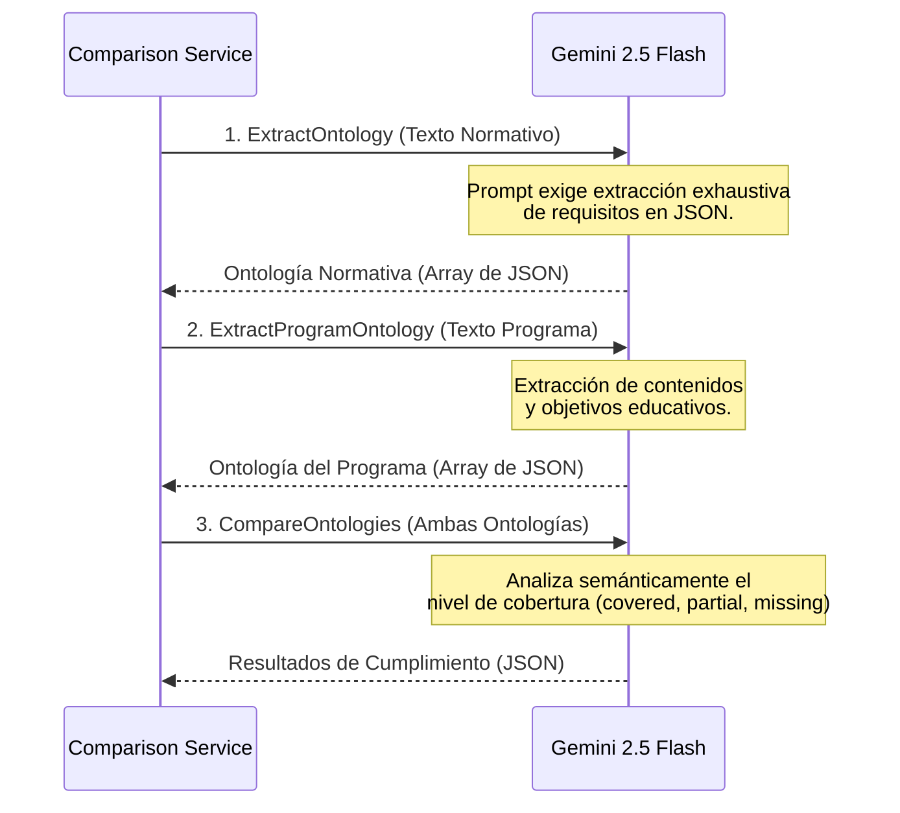

# 📚 Normative & Program Knowledge Graph (Genkit + Neo4j)

Este sistema de procesamiento holístico extrae la **Ontología Normativa** y los contenidos de **Programas Educativos** (Sílabos) a partir de documentos PDF, y mediante Inteligencia Artificial genera un Grafo de Conocimiento (Knowledge Graph) estructurado en **Neo4j** para evaluar el cumplimiento normativo universitario.

La arquitectura está potenciada por **Google Genkit**, **Gemini 2.5 Flash**, y el ecosistema de **Agent Skills de Neo4j**.

## 🚀 Arquitectura y Funcionamiento

El flujo de trabajo central de la aplicación consta de 3 fases:

### Diagrama de Flujo de Datos Global



### Funcionamiento del LLM (Comparación Holística)

El modelo de lenguaje (Gemini 2.5 Flash) realiza la abstracción en 3 llamadas estructurales (Generative Steps):



1. **Extracción y Procesamiento:**
   - La API recibe los PDFs normativos y del programa a través de Endpoints REST en **Express.js** (`multer`).
   - Se utiliza `pdf-parse` para extraer el texto y preservar su estructura de párrafos básicos.
2. **Generación de Ontologías y Comparación (Gemini 2.5 Flash):**
   - El texto extraído de los documentos (hasta 700k caracteres por documento) se procesa de manera *holística* mediante **Google Gemini 2.5 Flash**. Se evitan técnicas de *chunking* para garantizar que el LLM comprenda la estructura global y emita una evaluación precisa.
   - El sistema analiza la brecha o nivel de cumplimiento entre los requisitos normativos extraídos y los contenidos dictados en la materia. 
   - Para manejar llamadas masivas sin riesgo de colapso, el sistema aumenta los tiempos de espera a nivel de red a 10 minutos (usando `undici` Global Dispatcher).
3. **Persistencia Híbrida Vectorial y Estructural:**
   - **Genkitx-Neo4j Agent Skills:** Se utiliza para la indexación y recuperación vectorial. Cuando el modelo genera los nodos, los insertamos en Neo4j pasándolos por la herramienta de `ai.index` o buscando mediante el retriever de Genkit, automatizando por completo la capa de *embeddings*.
   - **Native Neo4j Driver:** Mantenemos llamadas Cypher manuales (Transaccionales) exclusivamente para orquestar la topología de la base de datos de grafos, enlazar entidades lógicas (ej. relacionales "COVERS", "REQUIRES") y actualizar propiedades.

## 📦 Dependencias Principales

El proyecto usa tecnologías modernas de AI y Web:

### Dependencias Core
- **`@genkit-ai/core` & `@genkit-ai/google-genai`**: Framework principal de AI que orquesta las llamadas a Gemini, maneja los prompts y estandariza los metadatos y esquemas.
- **`genkitx-neo4j`**: Plugin de Agent Skills para Genkit. Provee la capacidad de inyectar indexadores y *retrievers* para vectorizar de forma nativa la ontología en Neo4j.
- **`genkitx-groq`**: Plugin de LLM alternativo soportado por la arquitectura.
- **`neo4j-driver`**: Controlador oficial de Neo4j para manejar transacciones ACID, subgrafos complejos y estructuras lógicas no soportadas nativamente por las Skills.
- **`express` & `cors`**: Servidor Web ligero.
- **`pdf-parse` & `multer`**: Utilidades para el manejo de streams de archivos `multipart/form-data` y extracción de texto raw de los PDFs.
- **`undici`**: Reemplazo nativo de fetch en Node para manipular globalmente el tiempo de espera HTTP (`setGlobalDispatcher`) durante generaciones largas de IA.

### Dependencias de Desarrollo
- **`typescript` & `ts-node`**: Entorno estático de tipado.
- **`jest` & `ts-jest` & `fast-check`**: Framework de testing con Property-Based Testing para análisis de robustez estructural.

## 🛠 Instalación y Uso Local

### 1. Requisitos
- **Node.js 18+** (Recomendado versión 20 LTS o superior).
- Una instancia de **Neo4j 5.x** corriendo localmente o en AuraDB.
- API Key de **Google Generative AI** (AI Studio).

### 2. Configuración del `.env`
Renombra `.env.example` a `.env` y rellena las variables:
```ini
NEO4J_URI=bolt://localhost:7687
NEO4J_USERNAME=neo4j
NEO4J_PASSWORD=password
GOOGLE_GENAI_API_KEY=tu_api_key_de_gemini
PORT=3000
```

### 3. Ejecución
```bash
npm install
npm run dev
```

El servidor quedará a la escucha en el puerto `:3000`. Puedes ingresar a `http://localhost:3000/api/graph` para probar.

## ☁️ Despliegue en Vercel

El proyecto fue refactorizado y preparado específicamente para desplegarse como **Serveless Functions** en Vercel. 

### Ajustes Implementados para Vercel
1. **Archivo `vercel.json`**: Enruta el tráfico hacia la carpeta `api/` (función serverless) en lugar del puerto web local. Fija el timeout en 60 segundos (depende de tu plan).
2. **Proxy Handler (`api/index.ts`)**: Encapsula y exporta asincrónicamente la App de Express. Esto satisface el wrapper Node.js de Vercel.
3. **Protección de FileSystem**: En Vercel, el sistema de ficheros es *Read-Only*. El `PDFProcessor` fue adaptado para ignorar errores silenciosamente al tratar de crear las carpetas locales (`processed`/`failed`). Las llamadas API como `/api/compare` procesan el PDF directamente desde memoria con buffers `multer`.

**Nota de Limitación de Timeout:** Dado que Vercel *Hobby* limita las ejecuciones Serverless de entre 10 y 60 segundos y la inferencia holística de Gemini puede durar minutos, las comparaciones intensivas deben ser lanzadas localmente o Vercel devolverá un error `504 Gateway Timeout`.

## 🧪 Pruebas y Endpoints Principales

- `GET /api/graph` - Obtiene las entidades y relaciones optimizadas para frontend (nodos semánticos).
- `GET /api/graph/raw` - Devuelve todos los nodos normativos del grafo generados por la comparación.
- `POST /api/search` - Prueba del Agent Skill vectorial `genkitx-neo4j`. Pásale `{ "query": "..." }` y el motor te devolverá los nodos más similares almacenados en embeddings.
- `POST /api/compare` - Sube de forma estructurada los archivos *normative* y *program*. Realiza la abstracción completa y lo almacena en DB.

## 📡 Observabilidad y Trazas (¿Por qué no lo veo en LangSmith?)

A diferencia de proyectos construidos con LangChain, este proyecto está construido enteramente sobre **Google Genkit**. Por lo tanto, las trazas y la ejecución del LLM **no aparecerán en LangSmith**. 

Genkit provee su propia interfaz de desarrollo local para ver cada paso, los prompts exactos, la respuesta del LLM y las métricas de rendimiento.

Para ver las trazas locales de tu LLM, en una terminal paralela ejecuta:
```bash
npx genkit start
```
Esto abrirá el **Genkit Developer UI** en tu navegador (usualmente en `localhost:4000`), donde podrás inspeccionar visualmente todas las peticiones a Gemini y el comportamiento de los Agent Skills en tiempo real.

Para ejecutar la base de testing local:
```bash
npm test
```
