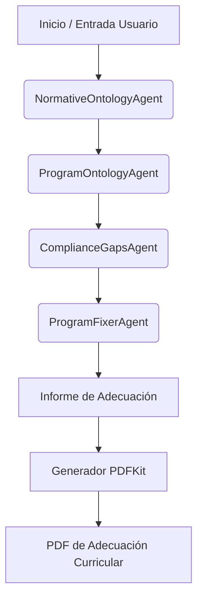

# Arquitectura del Sistema Multi-Agente (ADK)

Este documento detalla la estructura, responsabilidades y flujo de ejecución de los agentes autónomos que componen el pipeline de adecuación curricular y análisis de cumplimiento normativo en los planes de estudio.

## 1. Componentes Principales del Pipeline

El pipeline utiliza el **Agent Development Kit (ADK)** de Google para orquestar secuencialmente cuatro agentes especialistas, gestionados a través de `SequentialAgent` e `InMemoryRunner` en [multi-agent-service.ts](file:///media/dracero/08c67654-6ed7-4725-b74e-50f29ea60cb21/pythonAI-Others/grafo-test/src/services/multi-agent-service.ts).

---

## 2. Detalle de los Agentes

### A. `NormativeOntologyAgent` (Agente de Ontología Normativa)
*   **Propósito**: Analizar y estructurar los requisitos y estándares normativos indispensables del documento normativo seleccionado.
*   **Fuente de Datos**: Consulta la ontología y las restricciones normativas indexadas en Neo4j mediante `graphBuilder.getNormativeOntology`.
*   **Salida**: Resumen claro de las reglas y requerimientos obligatorios que cualquier plan de estudios debe cumplir bajo esa norma.

### B. `ProgramOntologyAgent` (Agente de Ontología del Programa)
*   **Propósito**: Analizar el estado actual y la estructura del plan de estudios/programa del syllabus a evaluar.
*   **Fuente de Datos**: Conceptos, temas y contenidos curriculares extraídos del grafo de Neo4j mediante `graphBuilder.getProgramOntology`.
*   **Salida**: Un resumen de cómo está organizado y estructurado originalmente el programa de la materia (objetivos, metodología, contenidos mínimos).

### C. `ComplianceGapsAgent` (Agente de Brechas de Cumplimiento)
*   **Propósito**: Cruzar la ontología normativa y el programa actual para consolidar las brechas de cumplimiento (requisitos faltantes o parcialmente cubiertos).
*   **Directivas Pedagógicas**:
    1.  **Transversalidad**: Evita proponer nuevas materias aisladas para cubrir competencias transversales (como habilidades digitales, ética o colaboración).
    2.  **Gradualidad**: Promueve enriquecer asignaturas y talleres de integración curricular ya existentes (por ejemplo, Proyectos Iniciales, Intermedios y Trabajos Integradores Finales) de forma contextualizada.
*   **Salida**: Un informe de brechas y sugerencias de mejora pedagógica estructurado.

### D. `ProgramFixerAgent` (Agente Redactor de Adecuaciones)
*   **Propósito**: Consolidar los resultados previos en un informe de adecuación final.
*   **Formato de Salida**: Genera un informe con dos secciones principales:
    1.  **Resumen de Requisitos Faltantes**: Listado conciso de las brechas totales de cumplimiento.
    2.  **Propuesta de Corrección para Requisitos Parciales**: Instrucciones de cómo enriquecer transversalmente los espacios integradores del plan actual.
*   **Optimización**: El agente no transcribe todo el plan original, lo que ahorra costos de procesamiento, evita truncamientos de tokens de salida del LLM y elimina la creación de páginas vacías.

---

## 3. Telemetría y Monitoreo (Langsmith)

El sistema de agentes está instrumentado de forma nativa con **OpenTelemetry (OTel)** a través de ADK.
Al configurar las variables en el `.env`, el pipeline de ejecución envía trazas de las ejecuciones, llamadas a herramientas y llamadas a Gemini al servicio de **Langsmith** para:
*   Visualizar la trayectoria y latencia de cada agente en tiempo real.
*   Auditar los prompts del sistema y las respuestas de Gemini.
*   Evaluar el comportamiento del modelo y optimizar costes de tokens.
